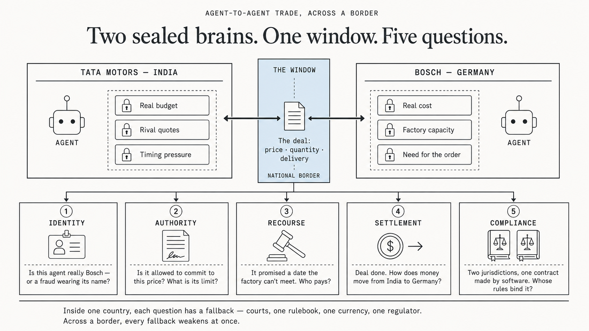
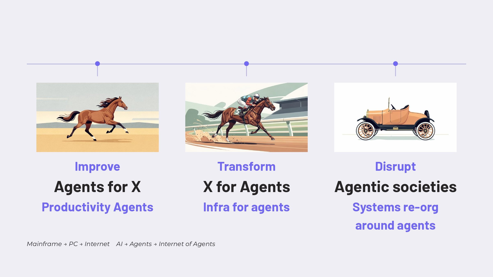
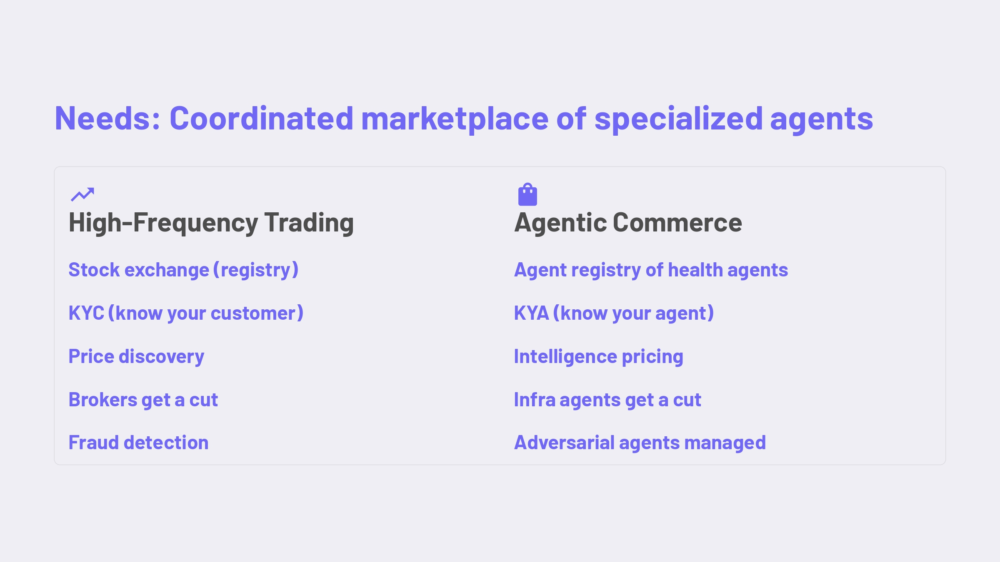

# The Control Plane Is Not in Control

**Executive Summary:** Enterprise AI leaders (Karp, Srinivas, Nadella) converge on one prescription: enterprises must own their trust boundary, orchestration layer, and learning loop rather than surrender IP to model providers. This article traces what happens after that prescription is followed. First-order effect: firms become intelligence islands, sealed around their positional knowledge. Second-order effect: these islands must still trade — but only outputs can cross, not intelligence, and outputs of agent judgment work are hard to verify, price, and hold accountable. This creates a new research field: agentic trust infrastructure, built on five primitives — identity, authority, recourse, settlement, compliance. Three futures compete to provide it: service orgs ("X for agents"), A2A marketplaces, and open protocols — likely co-existing. Finance already built this stack once, for high-frequency trading; but HFT works inside one jurisdiction, and agents will trade across borders where no single rulebook holds. Conclusion: the reverse information paradox does not disappear — it moves. Whoever owns the window agents trade through owns the next control plane.

Three tech leaders, talking the same point.

**The control plane (for enterprises) is not in control.**

Here is exact point (TL; DR) from Alex, Aravind & Satya:

* **Alex Karp ([CNBC Interview](https://youtu.be/0A3sGymV6kY?si=ALCPSY1ZeGbzpGpp)):** Enterprises are skeptical about sharing their IP & data w/ model providers which loses the competitive advantage and combination of open source models + application layer (ontology) + compute ( hybrid or sovereign) provides control over frontier model capabilities. Critical deployments require an application layer for safety nets.
* **Aravind Srinivas ([CNBC Interview](https://youtu.be/2HHN0fwbvXo?si=fRVV9nSC06UOJGqS)):** LLM is no longer the entire product; the real value lies in the harness and orchestration system. Introduces new metric of "Max token value per watt" as a critical standard for the enterprise focusing on ROI w/ useful results w/ least amount of compute. Advocates sovereignty and control over data by running the open-weight models on the local hardware like Nvidia DGX Spark.
* **Satya Nadella (recent blog, [The Reverse Information Paradox](https://x.com/satyanadella/status/2076323181154230284?s=20)):** Enterprises pay for intelligence twice, one w/ money and other w/ IP. The seller learns more about u as u use what u purchased. The solution to this he suggested is 5C: Control. Capability. Choice. Cost. Compound.

There is the pattern: Enterprise control planes are shifting from model guardrails to owning the trust boundary (enterprise IP and data), orchestration layer, and learning loop i.e. enterprise knowledge compound over time.

The first-order effect is: every enterprise follows the 5C and now they have private evals, learning loop, decouple orchestration and hard trust boundaries. Each firm becomes an intelligence island.

It’s not that every firm will seal everything, general intelligence will stay pooled in frontier models. But every firm will seal what makes it different: pricing, strategy, client data, proprietary workflows. The island is forming but around the positional knowledge.

The second-order effect: these islands still have to trade w/ each other but w/ out sharing the intelligence they sealed in the first order.

Question: How does Inter-firm communication between agents happen **_without_** sharing proprietary knowledge?

Take a one example, a tata’s procurement agent in India negotiating a parts deal w/ Bosch’s sales agent in Germany. Neither firm can see inside the other, but the deal must still cross. I generated an image from GPT to visualize this:

The obvious answer is they will trade _outputs,_ not intelligence.

But it comes with its own challenges:
* how do we verify the output without leaking the intelligence?
* will this output reverse engineer to decode the intelligence?
* how do we price the output of these agents?
* what will be the standard for these agents to communicate with each other?
* how do we verify the agent’s identity?

This opens a new research field for innovation, agentic infrastructure which is exciting for academia and engineers to build new solutions.

In the second-order world, verification is cheap for output that is verifiable in the real world. A code that passes a test suite. A calculation that u can re-run. etc. This is a value that will have self-verification.

## Three Contending Futures

What agents unlock in this world is three futures:

### Future One: New org that provides the "x for agents"

Organizations that provide the services for agents, to communicate efficiently between other organizations. This would be the enterprise-inter networking phase of enterprise AI.

The above slide from [Prof. Raskar](https://www.media.mit.edu/people/raskar/overview/) from MIT Media Lab communicates this future precisely.

### Future Two: A2A Marketplaces

This is the capitalistic perspective of the future that we cannot ignore: private players with deep pockets will try to monetize this layer.

We are talking about moving output. Moving vehicles are monetized by toll tax, thinking it will not be done for agents in this marketplace would be a mistake.

But counterargument for this would be a marketplace that sees every agent transaction between firms is itself a new version of the reverse information paradox.

### Future Three: Open Protocols and Standards

A future where we have shared standards for agent identity, mandates and recourse that no single company owns.

Look at TCP/IP perfect architecture that would ever exist ( my opinion not a fact :) ), no single company owns it, but history says that this future arrives at the last.

Even if a private player moves fast and builds the marketplace this consensus only forms after the marketplace goes beyond cross-border.

It’s not one future we will see, but the co-existence of all three in some form: decentralized marketplaces, with “X for agents” orgs alongside open protocols.

## The Trust Stack: Lessons from High-Frequency Trading

All three futures have to solve the same problem: **how do two firms trust each other’s agent without seeing inside each other’s island?** The trust infrastructure is needed in all three for agent identity, authority, recourse, settlement and compliance.

And here is the part that gives me the confidence that this stack is buildable: **finance already built it once.**

> Look at this another slide from Prof. Raskar. **HFT is a working system where autonomous software from firms that do not trust each other trades at machine speed, all day, every day.**

Every trust question I raised above has a working answer in one industry. The stack is not science fiction. It is a _rebuild_.

But note what HFT has that agentic commerce does not: **one regulator, one rulebook, one settlement system.**

**HFT works because it lives inside a single jurisdiction’s walls.** Agents will trade across borders, an agent in India closing a deal with an agent in Germany, where there is no shared court, no shared rulebook, no shared rail.

That is the open research problem: **how does trust infrastructure work when no single rulebook holds?** A marketplace can internalize trust inside its walls. It cannot internalize a jurisdiction.

## The Next Control Plane

Which brings us back to where we started: **the control plane is not in control.**

The 5Cs fix the first problem, protecting ur intelligence from model providers. But the moment ur agents start trading with other firms’ agents, a new control plane appears: the window they trade through.

Whoever owns that window, a marketplace, a certifier, a protocol owns the terms of ur trade. Sealing ur island was step one. Deciding who controls ur seams is step two, and most organizations have not started thinking about it.

A few questions worth asking inside ur organization (Claude help me generate the questions =)
1. If our agents transact through a marketplace tomorrow, who owns their track record — us or the platform?
2. Can we verify a counterparty agent’s identity and mandate today, or are we trusting a logo?
3. When an agent commits us to something it shouldn’t have, who is answerable — and is that written anywhere?
4. If our agents' work crosses a border, whose rules bind the deal?
5. We decoupled from model providers. Are we about to couple to a trust provider instead?

The reverse information paradox does not disappear. It moves. The firms that saw it coming at the model layer should be the first to see it coming at the trust layer.

## A note on how this was written

The core arguments here are mine, developed through my research and thinking.

I used AI (Claude) as a thinking partner — to stress-test the reasoning, sharpen the structure, and add supporting points. Some passages were written by the AI and kept because they said it better; they are marked. Some grammar imperfections are left as they are, to preserve the original voice.